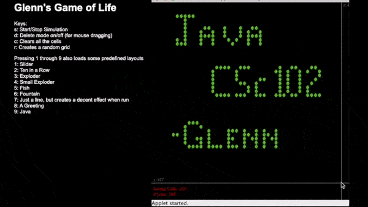

# Glenn's Conway's Game of Life

Back in 2003 I wrote this little implementation of [Conway's Game of Life](https://en.wikipedia.org/wiki/Conway%27s_Game_of_Life) as part of a [programming competition](hallOfFame.jpg) at Rhodes University in my first year studying computer science. Given the sad news of Conway's recent passing I thought it fitting to track down the code (thanks Caro!) and relive the glory of Java applets.

Modern browsers don't support applets any longer, but you can run the code with `appletviewer`:

```
appletviewer myLife.html
```

